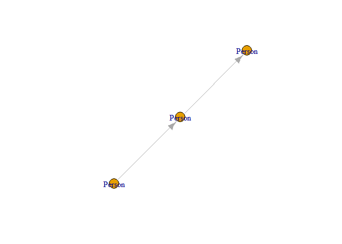

<!-- README.md is generated from README.Rmd. Please edit that file -->

# kuzuR

<!-- badges: start -->

[](https://lifecycle.r-lib.org/articles/stages.html#experimental)

<!-- badges: end -->

## Overview

`kuzuR` provides an R interface to the [Kuzu Graph
Database](https://kuzudb.com/), a high-performance, embedded graph
database. The package acts as a wrapper around the official Python
`kuzu` client, using the `reticulate` package to bridge the two
languages. This allows you to interact with Kuzu seamlessly within your
R environment, integrating its powerful graph computation capabilities
into your existing data analysis workflows.

The primary goal of `kuzuR` is to provide an idiomatic R experience
for: - Creating and managing Kuzu database instances. - Executing Cypher
queries. - Loading data from and retrieving results into R data frames
and tibbles. - Converting graph query results directly into R-native
graph objects like `igraph` and `tidygraph`.

## Installation

`kuzuR` requires a working Python installation. Once Python is
available, you can install the package and its Python dependencies in
two steps.

1.  **Install the R package** from GitHub:

``` r
# install.packages("pak")
pak::pak("WickM/kuzuR")
```

2.  **Install Python dependencies:** Use the built-in helper function to
    install `kuzu`, `pandas`, and `networkx` into a dedicated
    environment.

``` r
library(kuzuR)
install_kuzu()
```

## Usage

Here is a complete example demonstrating how to create a database,
define a schema, load data, and run queries.

``` r
library(kuzuR)
library(igraph)

# 1. Create a database in a temporary directory
db_path <- tempfile()
db <- kuzu_database(db_path)
con <- kuzu_connection(db)

# 2. Define a schema
# Create a 'Person' node table with a STRING name and INT64 age
schema_query_1 <- "CREATE NODE TABLE Person (
  name STRING,
  age INT64,
  PRIMARY KEY (name)
)"
kuzu_execute(con, schema_query_1)
#> <kuzu.query_result.QueryResult object at 0x0000022BB818B650>

# Create a 'Knows' relationship table
schema_query_2 <- "CREATE REL TABLE Knows(FROM Person TO Person, since INT64)"
kuzu_execute(con, schema_query_2)
#> <kuzu.query_result.QueryResult object at 0x0000022BB818B680>

# 3. Load data from R data frames
# Create node data
nodes <- data.frame(
  name = c("Alice", "Bob", "Carol"),
  age = c(30, 40, 50)
)

# Create edge data
edges <- data.frame(
  from_person = c("Alice", "Bob"),
  to_person = c("Bob", "Carol"),
  since = c(2010, 2015)
)

# Use kuzu_copy_from_df to load the data
kuzu_copy_from_df(con, "Person", nodes)
# Rename columns to match Kuzu's expected FROM/TO for relationships
names(edges) <- c("FROM", "TO", "since")
kuzu_copy_from_df(con, "Knows", edges)

# 4. Execute Cypher queries
# Retrieve data as a data frame
query_result <- kuzu_execute(con, "MATCH (p:Person) RETURN p.name, p.age")
as.data.frame(query_result)
#>   p.name p.age
#> 1  Alice    30
#> 2    Bob    40
#> 3  Carol    50

# 5. Convert graph results to R objects
# Run a query that returns a graph structure
graph_result <- kuzu_execute(con, "MATCH (a:Person)-[k:Knows]->(b:Person) RETURN a, k, b")

# Convert the result directly to an igraph object
g <- as_igraph(graph_result)

# Now you can work with it as a standard igraph object
print(g)
#> IGRAPH c34ee50 DN-- 3 2 -- 
#> + attr: name (v/c), _id (v/x), _label (v/c), age (v/n), Person (v/l),
#> | since (e/n), _label (e/c), _id (e/x), _src (e/x), _dst (e/x)
#> + edges from c34ee50 (vertex names):
#> [1] Person_Alice->Person_Bob   Person_Bob  ->Person_Carol
plot(g)
```

<div class="figure">


<p class="caption">

Plot of the graph structure created from Kuzu query results.
</p>

</div>

## Learning and Getting Help

This package is currently **experimental**. The core API is subject to
change as we work towards a stable release.

- For more detailed examples and workflows, please see the package
  vignettes (coming soon).
- If you encounter a bug or have a feature request, please file an issue
  on [GitHub](https://github.com/WickM/kuzuR/issues).
