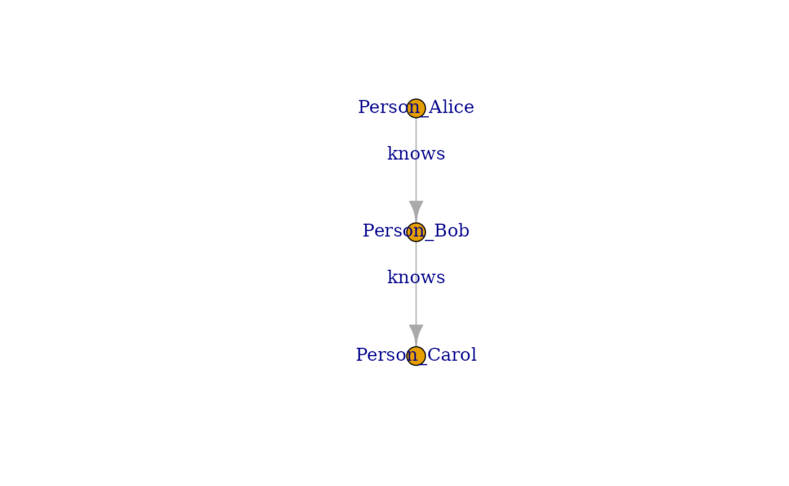
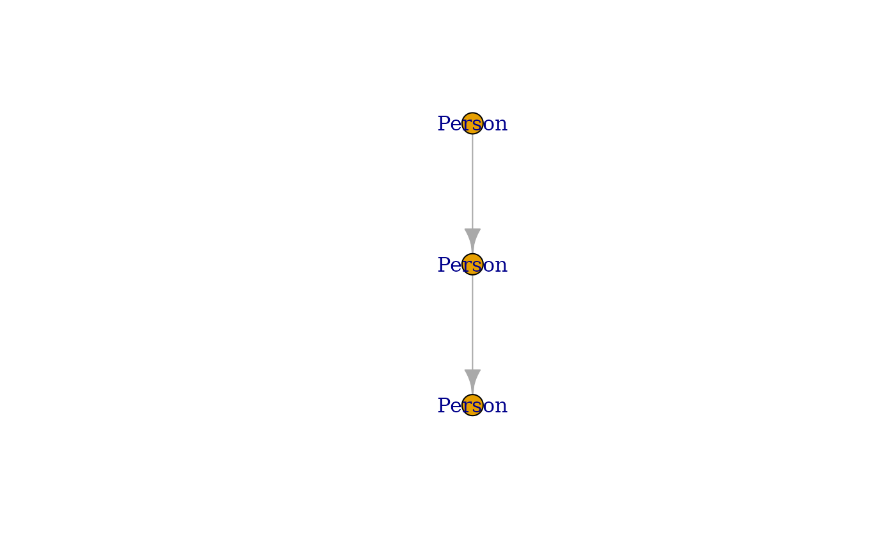

# Graph Library Integrations

## Introduction

This vignette demonstrates how to convert Kuzu query results into
various R graph library objects, including `igraph`, `tidygraph`, and
`g6R`. It showcases the seamless integration of `kuzuR` with popular R
packages for graph analysis and visualization.

## Converting to `igraph`

The `igraph` package is a powerful tool for graph manipulation and
analysis in R. `kuzuR` provides a direct conversion function
[`as_igraph()`](https://wickm.github.io/kuzuR/reference/as_igraph.md) to
transform Kuzu query results into `igraph` objects.

### Example: Loading and Converting Graph Data

First, let’s set up a Kuzu database and load some sample graph data.

``` r
library(kuzuR)
library(igraph)
#> 
#> Attaching package: 'igraph'
#> The following objects are masked from 'package:stats':
#> 
#>     decompose, spectrum
#> The following object is masked from 'package:base':
#> 
#>     union

# Create a connection
db_path <- tempfile()
con <- kuzu_connection(db_path)

# Create schema for nodes and relationships
kuzu_execute(con, paste("CREATE NODE TABLE Person(name STRING, age INT64,",
                        "PRIMARY KEY (name))"))
#> <kuzu.query_result.QueryResult object at 0x7faadf0678c0>
kuzu_execute(con, "CREATE REL TABLE Knows(FROM Person TO Person, since INT64)")
#> <kuzu.query_result.QueryResult object at 0x7faadf185010>

# Prepare data frames
persons_data <- data.frame(
  name = c("Alice", "Bob", "Carol"),
  age = c(35, 45, 25)
)

knows_data <- data.frame(
  from_person = c("Alice", "Bob"),
  to_person = c("Bob", "Carol"),
  since = c(2010, 2015)
)

# Load data into Kuzu
kuzu_copy_from_df(con, persons_data, "Person")
kuzu_copy_from_df(con, knows_data, "Knows")
```

Now, let’s execute a query that returns graph data and convert it to an
`igraph` object.

``` r
# Query to get all persons and their relationships
graph_query_result <- kuzu_execute(con, paste("MATCH (p1:Person)-[k:Knows]->",
                                              "(p2:Person) RETURN p1, p2, k"))

# Convert the Kuzu result to an igraph object
igraph_graph <- as_igraph(graph_query_result)

# Print the igraph object summary
print(igraph_graph)
#> IGRAPH fcdbb75 DN-- 3 2 -- 
#> + attr: name (v/c), age (v/n), Person (v/l), label (v/c), _src (e/x),
#> | _id (e/x), since (e/n), _label (e/c), _dst (e/x)
#> + edges from fcdbb75 (vertex names):
#> [1] Person_Alice->Person_Bob   Person_Bob  ->Person_Carol

V(igraph_graph)$label <- igraph::V(igraph_graph)$name
E(igraph_graph)$label <- "knows"
plot(igraph_graph)
```



You can now perform standard `igraph` operations on `igraph_graph`.

## Converting to `tidygraph`

The `tidygraph` package offers a tidy data approach to graph
manipulation, integrating seamlessly with the tidyverse. `kuzuR`
supports conversion to `tidygraph` objects via
[`as_tidygraph()`](https://wickm.github.io/kuzuR/reference/as_tidygraph.md).

### Example: Converting to `tidygraph`

Using the same Kuzu query result, we can convert it to a `tidygraph`
object.

``` r
# Convert the Kuzu result to a tidygraph object
tidygraph_graph <- as_tidygraph(graph_query_result)

# Print the tidygraph object summary
print(tidygraph_graph)
#> # A tbl_graph: 3 nodes and 2 edges
#> #
#> # A rooted tree
#> #
#> # Node Data: 3 × 4 (active)
#>   name           age Person label 
#>   <chr>        <dbl> <lgl>  <chr> 
#> 1 Person_Alice    35 TRUE   Person
#> 2 Person_Bob      45 TRUE   Person
#> 3 Person_Carol    25 TRUE   Person
#> #
#> # Edge Data: 2 × 7
#>    from    to `_src`           `_id`            since `_label` `_dst`          
#>   <int> <int> <list>           <list>           <dbl> <chr>    <list>          
#> 1     1     2 <named list [2]> <named list [2]>  2010 Knows    <named list [2]>
#> 2     2     3 <named list [2]> <named list [2]>  2015 Knows    <named list [2]>
plot(tidygraph_graph)
```



## Interactive Visualization with `g6R`

The `g6R` package provides an R interface to the G6 JavaScript graph
visualization library, enabling rich, interactive visualizations
directly within R environments. Since `g6R` has built-in support for
`igraph` objects, you can easily create interactive visualizations by
first converting your Kuzu query result to an `igraph` object.

### Example: Creating an Interactive `g6R` Graph

Building on the previous examples, we can convert the Kuzu query result
into a `g6R` object. We can then customize the appearance of the nodes
and edges for a more informative visualization.

``` r
library(g6R)
#> 
#> Attaching package: 'g6R'
#> The following object is masked from 'package:graphics':
#> 
#>     legend
#> The following object is masked from 'package:utils':
#> 
#>     history
graph_query_result <- kuzu_execute(con, paste("MATCH (p1:Person)-[k:Knows]->",
                                              "(p2:Person) RETURN p1, p2, k"))
# Convert the Kuzu result to a g6R-compatible list
igraph_graph <- as_igraph(graph_query_result)

g6 <- g6_igraph(igraph_graph) |>
  g6_layout(d3_force_layout()) |>
  g6_options(
    animation = FALSE,
    node = list(
      style = list(
        labelText = JS("(d) => d.name")
      )
    ),
    edge = list(
      style = list(
        endArrow = TRUE,
        labelText = JS("(d) => d.data.label")
      )
    )
  ) |>
  g6_behaviors(
    zoom_canvas(),
    collapse_expand(),
    drag_canvas(),
    drag_element()
  ) |>
  g6_plugins("toolbar")


# Display the graph
g6
```
