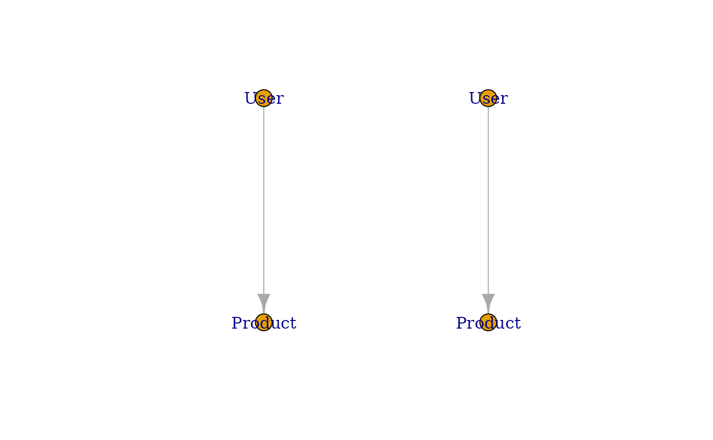

# Installation and Basic Usage

This vignette provides a guide to `kuzuR` and performing basic
operations, including creating a database, defining a schema, loading
data from various sources, and executing Cypher queries.

## 1. Connecting to a Database

First, load the `kuzuR` package and create a connection to a Kuzu
database. You can create an in-memory database or specify a path to a
database file on disk.

``` r
library(kuzuR)
con <- kuzu_connection(":memory:")
```

## 2. Data Types and Schema Definition

Kuzu supports a rich set of data types. When creating a schema, you need
to map your R data types to the corresponding Kuzu `LogicalTypeID`.

### Kuzu to R Data Type Mapping

| **Kuzu `LogicalTypeID`** | **R Type Equivalent** | **Description**                                                 |
|--------------------------|-----------------------|-----------------------------------------------------------------|
| `BOOL`                   | `logical`             | `TRUE`/`FALSE` values                                           |
| `INT64`                  | `integer`             | 64-bit signed integer                                           |
| `DOUBLE`                 | `numeric`             | Double-precision floating-point number                          |
| `STRING`                 | `character`           | UTF-8 encoded string                                            |
| `TIMESTAMP`              | `POSIXct`             | Date and time with timezone, stored as microseconds since epoch |
| `DATE`                   | `Date`                | Date (year, month, day)                                         |
| `INTERVAL`               | `difftime`            | Time interval (e.g., “1 year 2 months 3 days”)                  |
| `UUID`                   | `character`           | Universally Unique Identifier, stored as a string               |
| `LIST`                   | `list`                | Ordered collection of values of the same type                   |
| `MAP`                    | `list` (named list)   | Unordered collection of key-value pairs                         |

### Creating a Complex Schema

You can define a schema with node and relationship tables using
[`kuzu_execute()`](https://wickm.github.io/kuzuR/reference/kuzu_execute.md).
Here’s an example of a more complex schema:

``` r
# Create a node table for users with various data types
kuzu_execute(con, paste("CREATE NODE TABLE User(userID UUID, name STRING,",
                        "age INT64, is_active BOOL, created_at TIMESTAMP,",
                        "last_login DATE, notes STRING[],",
                        "PRIMARY KEY (userID))"))
#> <kuzu.query_result.QueryResult object at 0x7fbecd6e0260>

# Create a node table for products
kuzu_execute(con, "CREATE NODE TABLE Product(productID INT64, name STRING, PRIMARY KEY (productID))")
#> <kuzu.query_result.QueryResult object at 0x7fbecd6e02c0>

# Create a relationship table for user purchases
kuzu_execute(con, "CREATE REL TABLE Buys(FROM User TO Product, purchase_date DATE)")
#> <kuzu.query_result.QueryResult object at 0x7fbecc341040>
```

## 3. Loading Data

You can load data into your Kuzu tables from R data frames or external
files like CSV.

### Loading from a Data Frame

Use
[`kuzu_copy_from_df()`](https://wickm.github.io/kuzuR/reference/kuzu_copy_from_df.md)
to load data from an R `data.frame`.

``` r
library(jsonlite)
# Create data frames for nodes and relationships
users <- data.frame(
  userID = c("a1b2c3d4-e5f6-7890-1234-567890abcdef", "b2c3d4e5-f6a7-8901-2345-67890abcdef0"),
  name = c("Alice", "Bob"),
  age = c(35, 45),
  is_active = c(TRUE, FALSE),
  created_at = as.POSIXct(c("2023-01-15 10:30:00", "2022-11-20 14:00:00")),
  last_login = as.Date(c("2023-10-25", "2023-09-30")),
  stringsAsFactors = FALSE
)
# LIST types should be formatted as JSON strings
users$notes <- c(toJSON(c("note1", "note2")), toJSON("note3"))

products <- data.frame(
  productID = c(101, 102),
  name = c("Laptop", "Mouse")
)

buys <- data.frame(
  from_user = c("a1b2c3d4-e5f6-7890-1234-567890abcdef", "b2c3d4e5-f6a7-8901-2345-67890abcdef0"),
  to_product = c(101, 102),
  purchase_date = as.Date(c("2023-02-20", "2023-03-15"))
)

# Load data into Kuzu
kuzu_copy_from_df(con, users, "User")
kuzu_copy_from_df(con, products, "Product")
kuzu_copy_from_df(con, buys, "Buys")
```

### Loading from a CSV File

Use
[`kuzu_copy_from_csv()`](https://wickm.github.io/kuzuR/reference/kuzu_copy_from_csv.md)
to load data from a CSV file. For this to work, the file should be in
the current working directory.

``` r
# Create a CSV file in the project's root directory
csv_filename <- "products.csv"
write.csv(data.frame(productID = c(103, 104), name = c("Keyboard", "Monitor")),
          csv_filename, row.names = FALSE)

# Load data from the CSV file using just the filename
kuzu_copy_from_csv(con, csv_filename, "Product")

# Clean up the created file
unlink(csv_filename)
```

## 4. Executing Queries and Converting Results

You can execute Cypher queries using
[`kuzu_execute()`](https://wickm.github.io/kuzuR/reference/kuzu_execute.md)
and convert the results into various R formats.

``` r
# Execute a query to get users and their purchases
query_result <- kuzu_execute(con, "MATCH (u:User)-[b:Buys]->(p:Product) RETURN u.name, p.name, b.purchase_date")
```

### A Note on Query Results

The `QueryResult` object returned by
[`kuzu_execute()`](https://wickm.github.io/kuzuR/reference/kuzu_execute.md)
acts as an iterator over the results. This means it can only be consumed
once. Functions like
[`as.data.frame()`](https://rdrr.io/r/base/as.data.frame.html),
[`as_tibble()`](https://tibble.tidyverse.org/reference/as_tibble.html),
[`kuzu_get_all()`](https://wickm.github.io/kuzuR/reference/kuzu_get_all.md),
and the graph conversion functions will exhaust this iterator.

### Convert to Data Frame or Tibble

``` r
# Convert to a data frame
df_result <- as.data.frame(query_result)
print(df_result)
#>   u.name p.name b.purchase_date
#> 1  Alice Laptop      2023-02-20
#> 2    Bob  Mouse      2023-03-15

# Convert to a tibble
library(tibble)
tibble_result <- as_tibble(query_result)
print(tibble_result)
#> # A tibble: 2 × 3
#>   u.name p.name b.purchase_date    
#>   <chr>  <chr>  <dttm>             
#> 1 Alice  Laptop 2023-02-20 00:00:00
#> 2 Bob    Mouse  2023-03-15 00:00:00
```

### Use Query Results returned as list

``` r
query_result <- kuzu_execute(con, "MATCH (u:User)-[b:Buys]->(p:Product) RETURN u.name, p.name, b.purchase_date")

result <- kuzu_get_all(query_result)
print(result)
#> [[1]]
#> [[1]]$u.name
#> [1] "Alice"
#> 
#> [[1]]$p.name
#> [1] "Laptop"
#> 
#> [[1]]$b.purchase_date
#> [1] "2023-02-20"
#> 
#> 
#> [[2]]
#> [[2]]$u.name
#> [1] "Bob"
#> 
#> [[2]]$p.name
#> [1] "Mouse"
#> 
#> [[2]]$b.purchase_date
#> [1] "2023-03-15"

# only fetch 1. result 
query_result <- kuzu_execute(con, "MATCH (u:User)-[b:Buys]->(p:Product) RETURN u.name, p.name, b.purchase_date")

result <- kuzu_get_n(query_result, 1)
print(result)
#> [[1]]
#> [[1]]$u.name
#> [1] "Alice"
#> 
#> [[1]]$p.name
#> [1] "Laptop"
#> 
#> [[1]]$b.purchase_date
#> [1] "2023-02-20"

#Fetch next result
result <- kuzu_get_next(query_result)
print(result)
#> $u.name
#> [1] "Bob"
#> 
#> $p.name
#> [1] "Mouse"
#> 
#> $b.purchase_date
#> [1] "2023-03-15"
```

### Convert to Graph Objects

For queries that return graph structures, you can convert the results
into graph objects from packages like `igraph` or `tidygraph`. To do
this, the query must return the node and relationship variables
themselves, not just their properties.

``` r
# Execute a query that returns a graph structure 
graph_query_result <- kuzu_execute(con, "MATCH (u:User)-[b:Buys]->(p:Product) RETURN u, p, b")
igraph_obj <- as_igraph(graph_query_result)
print(igraph_obj)
#> IGRAPH bff5e0e DN-- 4 2 -- 
#> + attr: name (v/c), userID (v/x), age (v/n), is_active (v/x),
#> | created_at (v/n), last_login (v/x), notes (v/x), User (v/x), label
#> | (v/c), productID (v/n), Product (v/x), _src (e/x), _dst (e/x), _id
#> | (e/x), _label (e/c), purchase_date (e/x)
#> + edges from bff5e0e (vertex names):
#> [1] User_a1b2c3d4-e5f6-7890-1234-567890abcdef->Product_101
#> [2] User_b2c3d4e5-f6a7-8901-2345-67890abcdef0->Product_102

plot(igraph_obj)
```



``` r

# Convert to a tidygraph object
tidygraph_obj <- as_tidygraph(graph_query_result)
print(tidygraph_obj)
#> # A tbl_graph: 4 nodes and 2 edges
#> #
#> # A rooted forest with 2 trees
#> #
#> # Node Data: 4 × 11 (active)
#>   name    userID        age is_active created_at          last_login notes User 
#>   <chr>   <list>      <dbl> <list>    <dttm>              <list>     <lis> <lis>
#> 1 User_a… <uuid.UUID>    35 <lgl [1]> 2023-01-15 10:30:00 <date [1]> <chr> <lgl>
#> 2 Produc… <dbl [1]>     NaN <dbl [1]> NA                  <dbl [1]>  <dbl> <dbl>
#> 3 User_b… <uuid.UUID>    45 <lgl [1]> 2022-11-20 14:00:00 <date [1]> <chr> <lgl>
#> 4 Produc… <dbl [1]>     NaN <dbl [1]> NA                  <dbl [1]>  <dbl> <dbl>
#> # ℹ 3 more variables: label <chr>, productID <dbl>, Product <list>
#> #
#> # Edge Data: 2 × 7
#>    from    to `_src`           `_dst`       `_id`        `_label` purchase_date
#>   <int> <int> <list>           <list>       <list>       <chr>    <list>       
#> 1     1     2 <named list [2]> <named list> <named list> Buys     <date [1]>   
#> 2     3     4 <named list [2]> <named list> <named list> Buys     <date [1]>

plot(tidygraph_obj)
```
